<div align="center">



</div>

> 🎬 **The diagrams are alive** — pure-CSS animations baked into the SVGs (floating cubes,
> flowing request arrows, pulsing status lines). GitHub renders them natively; they honor
> `prefers-reduced-motion`. No JS, no GIFs, no image hosting.

## 🎨 Pick your theme

Four full color themes ship in [`docs/assets/`](docs/assets/) — every diagram in every theme:

| | | |
|---|---|---|
| 🔥 **ember** *(default)* |  | butter & espresso |
| 🌌 **midnight** |  | tokyo-night blues |
| 🍵 **matcha** |  | green tea & cream |
| 🫐 **berry** |  | plum & rosé |

Switch the whole README in one command:

```bash
sed -i 's#docs/assets/[a-z]*/#docs/assets/midnight/#g' README.md   # or matcha / berry / ember
```

<div align="center">


*A production-grade e-commerce platform for an artisan bakery — built the way real platforms are built.*

[⚡ Quick Start](#-quick-start-one-command) · [🏗 Architecture](#-architecture) · [📖 Swagger UI](#-api-docs--swagger-ui) · [🛒 Checkout Pipeline](#-the-checkout-pipeline) · [🔌 Port Map](#-one-service-one-port) · [☸️ Kubernetes](#️-deploying-to-kubernetes) · [🛠 Troubleshooting](#-troubleshooting)

</div>

---

## ⚡ Quick Start (one command)

> The entire platform — database, cache, gateway, 21 services, storefront — on any machine with Docker.

```bash
docker compose up --build -d        # or: make up
```

| What | Where | Credentials |
|---|---|---|
| 🥐 **Bakery storefront** | http://localhost:8080 | — |
| 📖 **Swagger UI** | http://localhost:3000/api/docs | — |
| 🚪 **API gateway** (route index) | http://localhost:3000/api | — |
| 🩺 **Platform health** | http://localhost:3000/api/status | — |
| 🗄 **Adminer (DB UI)** | http://localhost:8081 | server `postgres` · `bakery` / `bakery` |
| 🐘 **PostgreSQL** | localhost:5432 | `bakery` / `bakery` |
| 👤 **Demo login** | `amelie@crumbandember.dev` | `baguette` |
| 🎟 **Promo codes** | `CRUMB10` · `DAYOLD50` | −10% / −50% |

```bash
make smoke      # login → token verify → cart in Redis → order in Postgres ✅
make logs       # live JSON log firehose from all 26 containers
```

---

## 🏗 Architecture



One entry point, two paths: Traefik sends `/` to the nginx storefront and `/api` to the
gateway, which stamps every request with an `x-request-id` and proxies to the owning
domain service on **its own port**. Carts live in Redis with a 7-day TTL; users,
products, orders, payments and invoices live in PostgreSQL.

---

## 📖 API Docs — Swagger UI

The gateway serves interactive documentation for all **53 endpoints across 23 services**,
with try-it-out enabled — no Postman required.

| Endpoint | Compose | Kubernetes |
|---|---|---|
| **Swagger UI** (interactive) | http://localhost:3000/api/docs | http://bakery.local/api/docs |
| **OpenAPI 3 spec** (Postman/Insomnia import) | http://localhost:3000/api/openapi.json | http://bakery.local/api/openapi.json |
| **Route index** | http://localhost:3000/api | http://bakery.local/api |
| **Live upstream health** (all services, one call) | http://localhost:3000/api/status | http://bakery.local/api/status |

---

## 🛒 The Checkout Pipeline



One click in the storefront drives seven services, and the UI narrates each hop live:
*"Order o_x91k2 received — taking payment… — scheduling delivery…"*. Every other service
is visible too:

| You see | Service behind it |
|---|---|
| 🧺 Basket icon + live badge, slide-out drawer | **cart-service** (Redis, 7-day TTL) |
| 👤 Sign in / Register modal, guest-basket merge on login | **auth-service** (scrypt + HMAC tokens) |
| `27 in stock` / `only 3 left` / `sold out` badges | **inventory-service** |
| Net / VAT / total in the basket | **pricing-service** `/quote` |
| Promo box — try `CRUMB10` or `DAYOLD50` | **promotion-service** |
| ★★★★★ reviews, read & post per product | **review-service** |
| Header search box | **search-service** |
| "Pairs well today: …" | **recommendation-service** |
| 🔴 Out-of-the-oven rail, past bakes struck through | **baking-schedule-service** |
| Footer health grid — one dot per service, 30 s refresh | gateway **`/api/status`** |
| Every click tracked | **analytics-service** |

---

## 🔌 One Service, One Port

Each service listens on its own port (`PORT` env → compose host port → k8s Service/containerPort):

| Port | Service | Port | Service |
|---|---|---|---|
| **3000** | api-gateway | 3011 | review-service |
| 3001 | auth-service | 3012 | search-service |
| 3002 | user-service | 3013 | recommendation-service |
| 3003 | product-catalog-service | 3014 | promotion-service |
| 3004 | inventory-service | 3015 | loyalty-service |
| 3005 | pricing-service | 3016 | recipe-service |
| 3006 | cart-service | 3017 | baking-schedule-service |
| 3007 | order-service | 3018 | supplier-service |
| 3008 | payment-service | 3019 | analytics-service |
| 3009 | delivery-service | 3020 | media-service |
| 3010 | notification-service | 3021 | invoice-service |
| 3022 | currency-service | 3023 | language-service |

*(Frontend 8080 · Adminer 8081 · Postgres 5432 · Redis internal.)* In compose you can
bypass the gateway and hit any service directly:

```bash
curl http://localhost:3006/carts/guest          # cart-service, straight to Redis
curl http://localhost:3003/products             # product-catalog, straight to Postgres
curl http://localhost:3017/schedule/today       # what's in the oven right now
```

---

## 📜 JSON Logging

Every container — Node services *and* nginx — emits one-line structured JSON on stdout,
ready for Fluent Bit / Loki / ELK. Each request produces **two lines** — a
`request received` line with the full request detail and a
`request completed/failed` line with status + duration — and *every* log line
written during the request (including application events like
`cart_item_added`) carries the same flat context fields:

```json
{"level":"info","time":"2026-07-27T04:30:57.100Z","service":"cart-service","version":"1.0.0",
 "traceId":"web-demo-1","requestUri":"/carts/u1?refresh=true","method":"GET",
 "query":{"refresh":"true"},"clientIp":"203.0.113.7","userAgent":"Mozilla/5.0 (iPhone...)",
 "msg":"request received: GET /carts/u1?refresh=true"}
{"level":"info","time":"2026-07-27T04:30:57.106Z","service":"cart-service","version":"1.0.0",
 "traceId":"web-demo-1","requestUri":"/carts/u1?refresh=true","method":"GET",
 "query":{"refresh":"true"},"clientIp":"203.0.113.7","userAgent":"Mozilla/5.0 (iPhone...)",
 "res":{"statusCode":200},"durationMs":7,"msg":"request completed: GET /carts/u1?refresh=true -> 200"}
```

4xx responses log at `warn`, 5xx (or thrown errors) at `error`. The audited
services (auth, order, payment, invoice) additionally stamp `browser`, `os`
and `device` parsed from the User-Agent. **Probe endpoints (`/health`,
`/ready`, and the gateway's `/api/status`) are excluded from request logging**
so Kubernetes polling never drowns out real traffic.

```bash
docker compose logs -f | grep web-demo-1     # follow one request across every hop
```

---

## 🧵 Distributed Tracing — `X-Trace-Id`

Every request carries a **trace id** end-to-end:

1. The **frontend** mints a fresh `X-Trace-Id` (`web-<uuid>`) per API call.
2. The **API gateway** accepts an incoming `X-Trace-Id` (or `X-Request-Id` as a
   fallback), mints one (`trace-<uuid>`) when neither is present, and forwards
   it to the owning service on every proxied request.
3. Every **service** stamps `traceId` on all of its structured log lines,
   echoes it back as an `X-Trace-Id` response header, and forwards it on
   server-to-server calls (order ⇄ payment, invoice → order, auth → notify).
4. **Error responses** (500s and gateway 502/504s) include the `traceId` in
   the JSON body so users can report an id you can grep for directly.
5. **Security audit rows** persist the trace id in the `metadata` JSONB
   column, correlating `security_audit_logs` with the log stream — no schema
   migration needed.

Incoming ids are sanitized (`[\w.:-]` only, capped at 128 chars) before use.

```bash
# Follow one request across the gateway and every service it touched:
docker compose logs -f | grep trace-59640d2f

# Or drive it yourself:
curl -si -H "x-trace-id: my-debug-run-1" http://localhost:8080/api/orders
```

---

## ☸️ Deploying to Kubernetes

25 Deployments with readiness/liveness probes, non-root + read-only rootfs + dropped
capabilities, HPA (2–8) on the gateway, PodDisruptionBudgets on the edge, Traefik Ingress —
templated once in `k8s/base/` and specialized per environment with Kustomize overlays in
`k8s/overlays/{dev,uat,production}/` (namespace, replica count, resource sizing, ingress host).

**CI/CD is split**: every service has its own GitHub Actions pipeline
(`.github/workflows/<service>.yml`) that builds, pushes to GHCR, and bumps that service's image
tag in the target overlay — CI only, no `kubectl` involved. **Argo CD** watches
`k8s/overlays/*` in this repo and applies the resulting diff to the actual clusters. See
[`docs/DEPLOYMENT.md`](docs/DEPLOYMENT.md) for the full picture, including the Argo `Application`
manifests in `argocd/` and how to gate uat/production behind manual approval.

```bash
# Manual / local fallback if you're not running Argo CD yet — same overlays,
# applied by hand instead of by CI + Argo:
./scripts/deploy.sh dev          # or: uat / production

# Everyday use once Argo CD is registered (see docs/DEPLOYMENT.md): push to
# services/auth-service/**, CI does the rest, Argo CD picks up the commit.

kubectl -n bakery-dev get pods -w
echo "<ingress-ip>  dev.bakery.local uat.bakery.local bakery.local db.bakery.local" | sudo tee -a /etc/hosts
curl http://dev.bakery.local/api/status | jq
```

---

## 🛠 Troubleshooting

| Symptom | Meaning | Fix |
|---|---|---|
| Storefront shows static data, footer says `degraded` | Gateway is up, some upstreams aren't | `curl /api/status` — it names the down services |
| Pods in `ImagePullBackOff` | Image tag doesn't exist in ghcr.io yet | Check the service's pipeline run in the Actions tab |
| `/api/xyz` → `No upstream for that path` | Prefix not in the route table | `GET /api` lists every valid prefix |
| Checkout stops at "taking payment…" | payment-service down or missing secrets | `kubectl -n bakery-<env> logs deploy/payment-service` |
| `bakery.local` (or `dev.`/`uat.` prefix) unreachable | hosts entry / ingress IP | `kubectl -n traefik get svc` → add to `/etc/hosts` |

---

<div align="center">

**Baked with 23 services, zero magic, and a healthy respect for structured logging.** 🥖

*Diagrams are hand-built, CSS-animated isometric SVGs in [`docs/assets/`](docs/assets/) — four themes, zero image hosting, rendered natively by GitHub.*

</div>


## ✨ New: 3D colourful frontend

The frontend (`services/frontend/index.html`) is now a candy-bright, 3D-themed single-page app:

- **Three.js hero** — floating 3D donuts (with sprinkles), cupcake, macarons and croissants with mouse-parallax camera
- **Dimensional UI** — chunky offset shadows, 3D tilt-on-hover product cards, candy palette (strawberry / butter / pistachio / blueberry)
- **Full API integration** — products, baking schedule, reviews, cart, promos (`CRUMB10`), auth, checkout chain (order → payment → delivery → invoice → loyalty → notification), live platform status in the footer
- **Offline preview mode** — if the gateway is unreachable it falls back to the seeded menu and a local basket, so the page works standalone too
- The previous minimal frontend is kept at `services/frontend/index.legacy.html`
- **No platform internals are exposed to shoppers**: the customer frontend has no API-doc links, no service-status widget, and no error copy that names services or infrastructure. Operators still have everything at `/api/docs`, `/api/status` and `/api` on the gateway (port 3000) — it's just not linked from the storefront.

### 💱 New: currency-service (port 3022)

A dedicated currency-conversion microservice at `/api/currency` with **47 currencies** — INR ₹, AED د.إ (UAE Dirham), CNY ¥ (Chinese Yuan), GBP £, JPY ¥, USD $, KRW, SAR, BRL, ZAR and many more:

- `GET /api/currency` — all currencies with names, symbols, decimals and EUR rates
- `GET /api/currency/rates?base=INR` — full rate table rebased onto any currency
- `GET|POST /api/currency/convert?amount=8.5&from=EUR&to=INR` — convert with formatted output

The frontend has a currency picker in the header: every price, cart line and total converts live, JPY/KRW-style zero-decimal currencies format correctly, the choice persists across visits, and checkout charges the payment-service in the selected currency. Rates are demo reference rates — swap the table in `services/currency-service/server.js` for a live FX feed in production.

### 🌐 New: language-service (port 3023)

A dedicated localization microservice at `/api/language` with **15 languages** — English, French, Spanish, German, Italian, Portuguese, Dutch, Polish, Turkish, Russian, Hindi, Arabic (RTL), Japanese, Chinese and Korean:

- `GET /api/language` — all supported languages with names, native names, flags and an RTL flag
- `GET /api/language/translations?lang=fr` — the full storefront-chrome string table for a locale, falling back to English for any missing key
- `GET|POST /api/language/translate?key=nav.oven&lang=ja` — translate a single UI string key

The frontend has a language picker in the header, right next to the currency picker: the nav links, search placeholder, sign-in button, basket label, hero copy and section titles all swap live, the page flips to `dir="rtl"` for Arabic, and the choice persists across visits. These are curated demo strings — swap `TRANSLATIONS` in `services/language-service/server.js` for a TMS (Phrase, Lokalise, Crowdin, ...) or an MT provider in production.

Run everything with `make up`, then open http://localhost:8080 (demo login: `amelie@crumbandember.dev` / `baguette`).

# 🚀 Production Security

> ⚠️ **Testing Only**
>
> This implementation is provided **for testing purposes only**.
>
> 🔐 In **production**, store all secrets in **Azure Key Vault** (or another secure secrets manager) and **never hardcode credentials** in source code, configuration files, or repositories.
